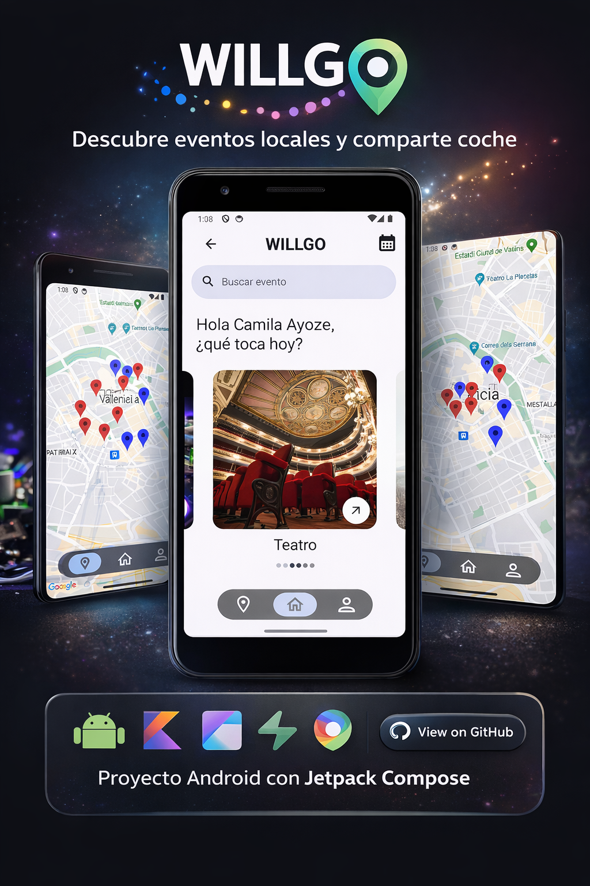
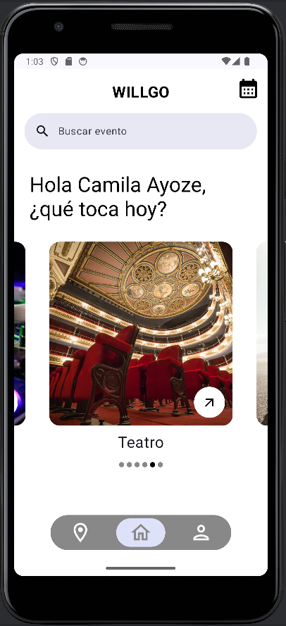
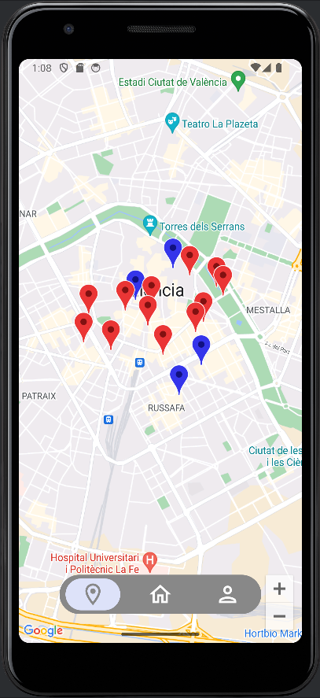
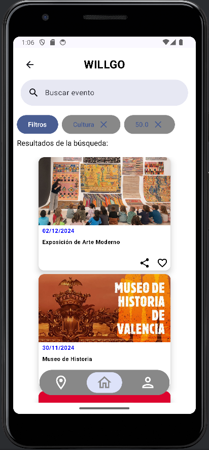
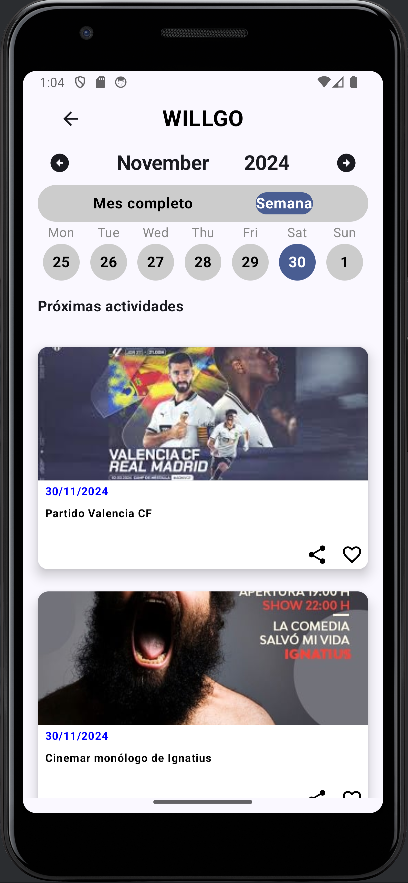

# WillGo – Red Social de Eventos Locales

WillGo es una aplicación móvil diseñada para conectar a los usuarios con los eventos más relevantes de su entorno local, ofreciendo una experiencia social y cultural centrada en la exploración, la planificación y la interacción entre personas.

Este repositorio contiene el **código fuente del proyecto**, junto con material visual y documentación general de la aplicación.

---

## Descripción general

WillGo es una aplicación móvil orientada a la **descubierta y gestión de eventos locales**, diseñada para conectar a personas interesadas en actividades culturales, sociales y de ocio dentro de su ciudad.

La aplicación permite explorar eventos como conciertos, teatro, comedia, deportes, fiestas y actividades culturales mediante **listados y un mapa interactivo**, ofreciendo una experiencia visual y social centrada en la participación y la conexión entre usuarios.

Uno de los elementos diferenciales de WillGo es su enfoque social: los usuarios pueden indicar que van solos a un evento y **descubrir otras personas que asistirán**, facilitando la interacción y la posibilidad de acudir juntos. Además, la aplicación incorpora funcionalidades de **coche compartido**, fomentando la movilidad colaborativa.

Está pensada para contextos donde es necesario:
- Descubrir eventos de forma rápida y visual
- Planificar actividades sociales y culturales
- Conectar con otras personas con intereses similares
- Facilitar la asistencia conjunta a eventos locales

---

## Funcionalidades principales

- Exploración de eventos locales mediante lista y mapa interactivo.
- Visualización de eventos por ubicación geográfica.
- Búsqueda avanzada con filtros por categoría, fecha y precio.
- Calendario de eventos con vista semanal y mensual.
- Indicación de asistencia a eventos.
- Descubrimiento de otros usuarios que asistirán al mismo evento.
- Sistema para compartir coche o encontrar transporte compartido.
- Guardado de eventos y ubicaciones favoritas.
- Interfaz móvil intuitiva y orientada a la experiencia de usuario.
- Arquitectura pensada para ser escalable y ampliable.

---

## Capturas de la aplicación

### Pantalla principal

### Mapa interactivo de eventos

### Resultados de búsqueda avanzada

### Calendario semanal de eventos

---

## Tecnologías utilizadas

- **Frontend móvil:** Kotlin, Jetpack Compose
- **Mapas y geolocalización:** Google Maps API
- **Base de datos:** Supabase
- **Arquitectura:** Aplicación móvil conectada a servicios externos
- **Control de versiones:** Git

---

## Estado del proyecto

Proyecto desarrollado como parte de un trabajo académico y enfocado a la exploración de arquitecturas móviles, experiencia de usuario y funcionalidades sociales aplicadas a eventos locales.

El proyecto es funcional y puede ampliarse con nuevas características.
